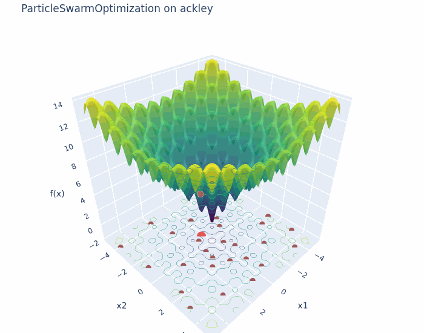
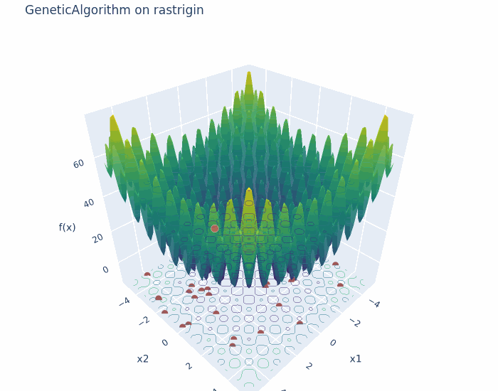
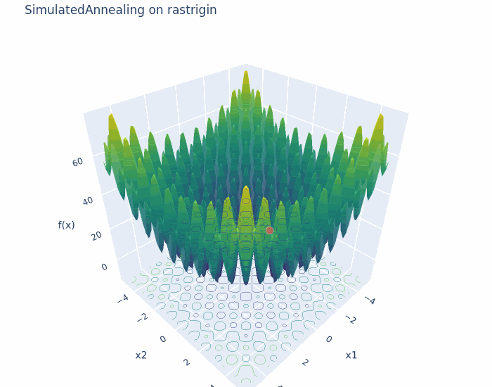
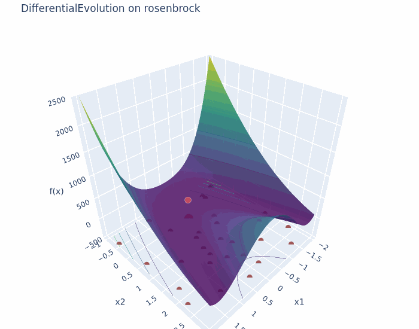
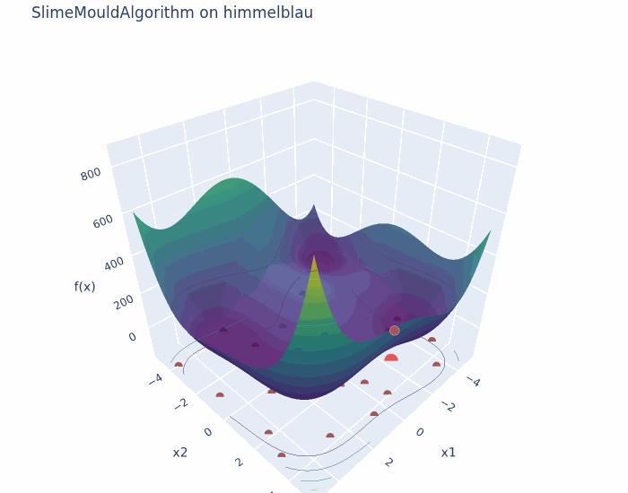

# Metaheuristics for Nonconvex Optimization

A study companion and experimentation playground for metaheuristic optimization algorithms
applied to nonconvex, multimodal functions — built for learning how Genetic Algorithms, Particle
Swarm Optimization, Simulated Annealing, Differential Evolution, and the Slime Mould Algorithm
behave, why they differ, and where each one shines or struggles.

## See it in action

Each GIF shows the benchmark-function surface, the population scattered across it per iteration
(gray), and the best-so-far point (red) trailing a line along the path it took. `SimulatedAnnealing`
has no population — just the single trajectory.

| PSO on Ackley | GA on Rastrigin | SA on Rastrigin | DE on Rosenbrock | SMA on Himmelblau |
|---|---|---|---|---|
|  |  |  |  |  |

- **[PSO](docs/notes/particle-swarm-optimization.md)** converges quickly on Ackley's smooth,
  moderately multimodal bowl — the whole swarm's momentum carries it to the basin.
- **[GA](docs/notes/genetic-algorithm.md)** and **[SA](docs/notes/simulated-annealing.md)** run on
  the *same* landscape, Rastrigin, deliberately — compare population search (GA) against a single
  wandering point (SA) on a field of many local minima.
- **[DE](docs/notes/differential-evolution.md)**'s difference-vector mutation follows Rosenbrock's
  curved valley rather than just descending the nearest slope.
- **[SMA](docs/notes/slime-mould-optimization.md)**'s random re-initialization keeps it from
  collapsing onto just one of Himmelblau's four equally-good minima.

Regenerate these with `uv run --group viz python scripts/generate_gifs.py` (needs the `viz`
dependency group: `kaleido` + `imageio`).

## What's here

- **`src/metaheuristics/`** — an installable package with from-scratch implementations of five
  algorithms, twelve 2D benchmark/test functions, interactive Plotly visualization helpers, and
  two scikit-learn-compatible estimators (`MetaheuristicSelector`, `MetaheuristicSearchCV`) for
  feature selection and hyperparameter tuning.
- **`notebooks/`** — one notebook per algorithm (surface + convergence + trajectory animation),
  a from-scratch-vs-library comparison notebook, and `notebooks/applications/` with signal
  processing and data science examples, including head-to-head comparisons against scikit-learn's
  own feature selection and hyperparameter search tools.
- **`docs/notes/`** — short study notes per algorithm (the update rule, key hyperparameters, when
  it does well/poorly), a benchmark-functions reference table, and an applications note covering
  the feature-selection/hyperparameter-tuning estimators.
- **`reference/`** — citations for the foundational papers and a place to keep source PDFs.
- **`tests/`** — a small pytest suite: benchmark functions evaluate correctly at their known
  optima, and each algorithm converges on the Sphere function within a loose smoke-test budget.

## Algorithms

| Algorithm | Module | Notes |
|---|---|---|
| Genetic Algorithm | `algorithms/genetic_algorithm.py` | Binary-encoded, decodes to real vectors |
| Particle Swarm Optimization | `algorithms/particle_swarm.py` | Inertia-weight variant (Shi & Eberhart, 1998) |
| Simulated Annealing | `algorithms/simulated_annealing.py` | Single-point search, not population-based |
| Differential Evolution | `algorithms/differential_evolution.py` | DE/rand/1/bin |
| Slime Mould Algorithm | `algorithms/slime_mould.py` | Li et al. (2020) |

All five share one interface, so they're interchangeable in notebooks and comparisons:

```python
from metaheuristics.algorithms.particle_swarm import ParticleSwarmOptimization
from metaheuristics.benchmarks.landscapes import rastrigin

result = ParticleSwarmOptimization(num_particles=40, max_iterations=100).optimize(
    rastrigin, rastrigin.bounds
)
result.best_solution, result.best_fitness  # np.ndarray, float
result.fitness_history, result.position_history  # per-iteration, for convergence/trajectory plots
```

`objective_fn` is a plain `f(x) -> float` over an $n$-dimensional real vector — the benchmark
functions in `metaheuristics.benchmarks.landscapes` are 2D, but the algorithms themselves are not
limited to 2D (see `notebooks/applications/fir_filter_design.ipynb`, a 21-dimensional problem).

Every function in `metaheuristics.benchmarks.landscapes` carries known metadata:

```python
rastrigin.bounds            # ((-5.12, 5.12), (-5.12, 5.12))
rastrigin.global_minimum    # (array([0., 0.]), 0.0)
```

See `docs/notes/benchmark-functions.md` for the full table (formula, domain, global minimum) of
all twelve functions, spanning bowl-shaped, valley-shaped, many-local-minima, multiple-global-
minima, and steep/rugged landscapes.

## Applications

Both feature selection and hyperparameter tuning are naturally discrete/mixed search problems.
Relaxed into a continuous box, either one can be driven by any of the five algorithms above and
wrapped as a standard scikit-learn estimator:

| Class | Module | Drop-in for |
|---|---|---|
| `MetaheuristicSelector` | `feature_selection.py` | `RFE`, `SelectKBest`, ... (`SelectorMixin`, works in a `Pipeline`) |
| `MetaheuristicSearchCV` | `model_selection.py` | `GridSearchCV`, `RandomizedSearchCV` |

```python
from sklearn.svm import SVC
from metaheuristics.model_selection import MetaheuristicSearchCV

search = MetaheuristicSearchCV(
    estimator=SVC(),
    param_space={"C": (1e-2, 1e4, "log"), "gamma": (1e-6, 1e1, "log")},
    cv=5,
)
search.fit(X, y)
search.best_params_, search.best_score_
```

Both accept any `scoring` sklearn understands (accuracy, F1, ROC-AUC, `neg_mean_squared_error`,
...) and any of the five optimizers. See `docs/notes/applications.md` for the full parameter
tables and objective-function math, and `notebooks/applications/` for worked examples and
comparisons against scikit-learn's own tools.

## Quickstart

This project uses [uv](https://docs.astral.sh/uv/) for dependency and environment management.

```bash
uv sync --all-extras --all-groups   # everything: algorithms, sklearn/plotly extras, notebooks, tests
uv run pytest                       # run the test suite
uv run jupyter lab                  # open the notebooks
```

`uv sync` installs `metaheuristics` itself in editable mode, so notebooks and tests can
`import metaheuristics...` directly — no `sys.path` hacks.

### Installing just the library

Core `dependencies` are just `numpy` — the five algorithms and benchmark functions have no other
runtime requirement. `metaheuristics.feature_selection`/`model_selection` need scikit-learn, and
`metaheuristics.viz` needs plotly; both are `[project.optional-dependencies]` extras rather than
hard dependencies, so a project consuming this as a package only pulls in what it actually uses:

```bash
uv add metaheuristics                       # numpy only
uv add "metaheuristics[sklearn]"            # + feature_selection / model_selection
uv add "metaheuristics[plotly]"             # + viz
uv add "metaheuristics[all]"                # everything above
```

(Notebook-only tools — Jupyter, matplotlib, mealpy, pandas, scipy — live in the `notebooks`
dependency group instead, since they're needed to run this repo's notebooks, not to use the
library. They're never installed by consumers.)
